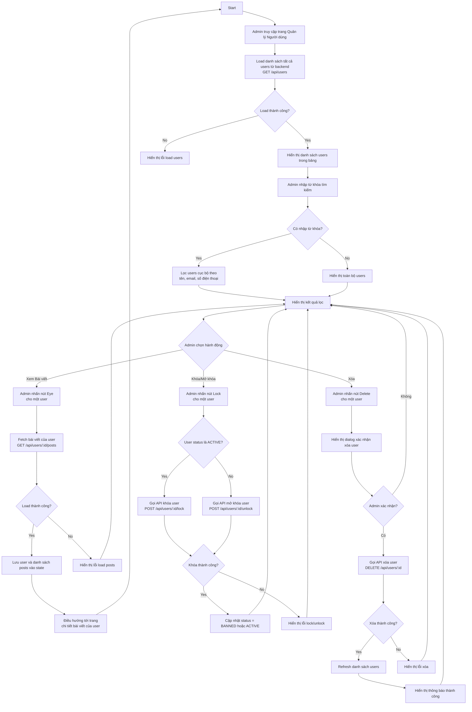

# Admin User Management Activity Diagram

Biểu đồ dưới đây mô tả luồng quản lý người dùng của Admin trong NhaTrangStay, dựa theo `src/pages/Admin/AdminUser/AdminUsers.jsx`.

## Ghi chú

- **Load danh sách users**: Admin mở trang, hệ thống gọi `userAPI.getAll()` để lấy toàn bộ user từ backend.
- **Tìm kiếm cục bộ**: Không gọi API mỗi khi nhập, chỉ lọc dữ liệu đã load trên client theo:
  - Full Name
  - Username
  - Email
  - Số điện thoại
- **Xem Bài viết**: Admin nhấn nút Eye, hệ thống gọi `userAPI.getPostsByUser(user.id)` để lấy bài viết của user đó, sau đó điều hướng tới trang chi tiết.
- **Khóa / Mở khóa User**: 
  - Nếu user status = `ACTIVE` → gọi `userAPI.lockUser(user.id)` → status thành `BANNED`
  - Nếu user status = `BANNED` → gọi `userAPI.unlockUser(user.id)` → status thành `ACTIVE`
  - Cập nhật ngay trên UI sau khi thành công
- **Xóa User**:
  - Hiển thị dialog xác nhận
  - Nếu chọn Xóa → gọi `userAPI.deleteUser(id)` → refresh danh sách → hiển thị thông báo thành công
  - Nếu chọn Hủy → quay lại danh sách
- **Trạng thái hiển thị**:
  - `ACTIVE` = "Available" (xanh)
  - `BANNED` = "Unavailable" (đỏ)
