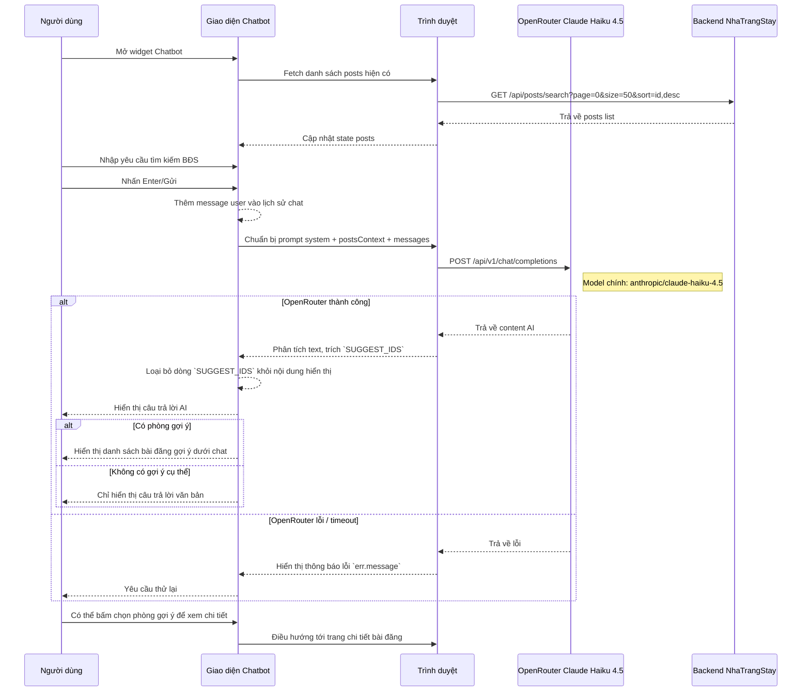

# Chatbot AI Sequence Diagram

File này mô tả trình tự các bước trong luồng tư vấn Chatbot AI của NhaTrangStay. Nội dung dựa theo `src/components/shared/User/common/ChatBot/ChatBot.jsx`.

## Ghi chú

- Trình tự này phản ánh hành vi trực tiếp của client React: Chatbot gọi OpenRouter ngay từ trình duyệt.
- `postsContext` được tạo từ dữ liệu bài đăng hiện có để giúp AI đối sánh ngữ nghĩa với yêu cầu của người dùng.
- Dòng `SUGGEST_IDS` là cơ chế nội bộ để ánh xạ gợi ý phòng từ phản hồi AI về các thẻ bài đăng hiển thị.
- Nếu OpenRouter gặp lỗi, chatbot không tự động retry mà hiển thị lỗi cho người dùng và cho phép họ gửi lại.
