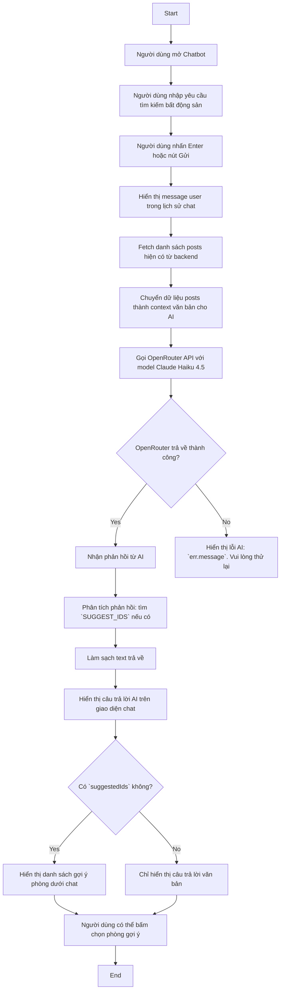

# Chatbot AI Activity Diagram

Biểu đồ dưới đây mô tả luồng hoạt động của Chatbot AI trong NhaTrangStay, dựa theo `src/components/shared/User/common/ChatBot/ChatBot.jsx`.

## Ghi chú

- Chatbot lấy tối đa 50 bài đăng hiện có từ `GET /api/posts/search` để tạo ngữ cảnh cho AI.
- Text gửi tới OpenRouter bao gồm:
  - prompt hệ thống với hướng dẫn tư vấn phòng trọ NhaTrangStay
  - danh sách phòng hiện có dưới dạng text
  - lịch sử hội thoại gần nhất của người dùng
- Mô hình sử dụng là `anthropic/claude-haiku-4.5`.
- Nếu OpenRouter trả lỗi, chatbot hiển thị `err.message` trong khung chat và người dùng có thể thử lại.
- Nếu phản hồi chứa `SUGGEST_IDS`, chatbot sẽ hiển thị các bài đăng tương ứng dưới dạng thẻ nhỏ.
- Phản hồi AI được làm sạch trước khi hiển thị để loại bỏ dòng `SUGGEST_IDS`.
