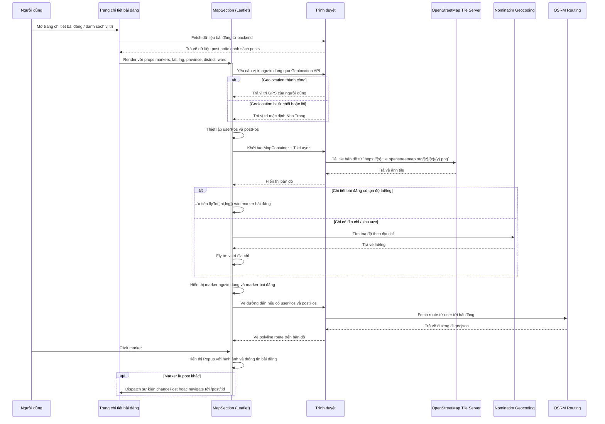

# Map Display Sequence Diagram

File này mô tả trình tự hiển thị bản đồ số trong NhaTrangStay, dựa theo `src/components/shared/User/Post/MapSection/MapSection.jsx` và cách nó được sử dụng trong `src/pages/User/PostDetail/PostDetailPage.jsx`.

## Ghi chú

- Bản đồ dùng `react-leaflet` với `MapContainer`, `TileLayer`, `Marker`, `Popup`.
- Tile data lấy từ OpenStreetMap.
- `MapFly` điều khiển zoom và di chuyển camera:
  - Ưu tiên dùng `lat`/`lng` trực tiếp nếu có.
  - Nếu không có tọa độ, gọi Nominatim để geocode địa chỉ (tỉnh, quận, phường).
- `Routing` dùng OSRM (router.project-osrm.org) để vẽ đường đi giữa vị trí người dùng và bài đăng.
- Click vào marker bài đăng có thể dẫn đến thay đổi bài đăng hiện tại hoặc điều hướng tới trang chi tiết bài đăng.
