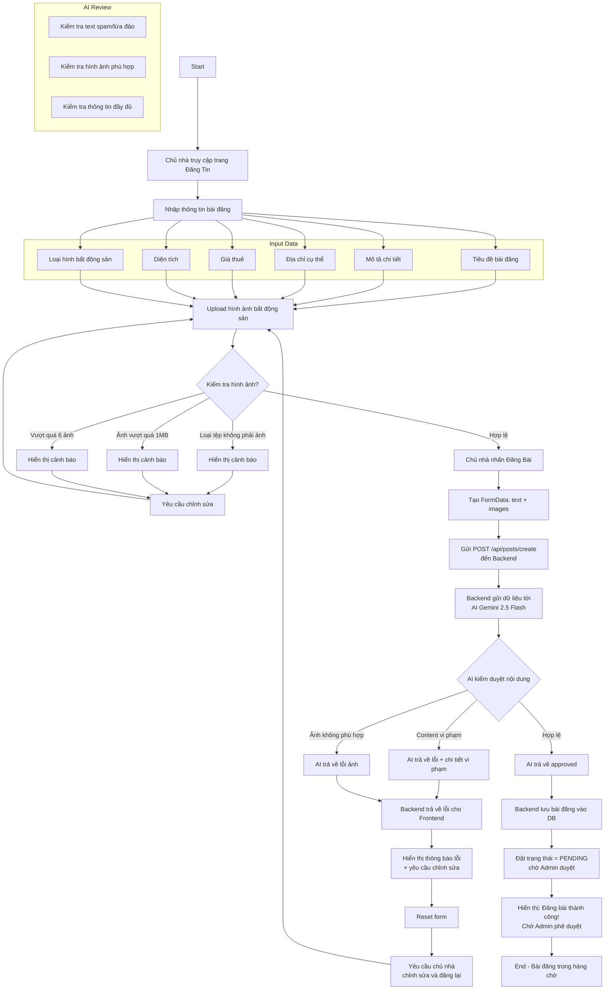

# Post Creation Activity Diagram

Biểu đồ dưới đây mô tả luồng đăng bài bất động sản trong NhaTrangStay, bao gồm quy trình kiểm duyệt tự động bằng AI Gemini 2.5 Flash, dựa theo `InforBase.jsx`.

## Ghi chú

- **Input validation frontend**: Kiểm tra loại tệp (phải là ảnh) và kích thước (max 1MB), tối đa 6 ảnh.
- **AI Review backend**: Sau khi nhận dữ liệu, backend gửi text + hình ảnh tới Gemini 2.5 Flash để:
  - Phát hiện spam, lừa đảo, nội dung không phù hợp trong text.
  - Kiểm tra hình ảnh có chứa nội dung vi phạm (ảnh đen, ảnh không rõ, ảnh người khác, v.v.).
  - Xác nhận đầy đủ thông tin bắt buộc.
  
- **Nếu AI phê duyệt**: Bài đăng được lưu vào DB với trạng thái `PENDING`, chờ Admin kiểm tra và phê duyệt lần cuối.
- **Nếu AI từ chối**: Backend trả về mã lỗi và chi tiết, Frontend hiển thị thông báo cho phép chủ nhà chỉnh sửa và đăng lại.
- Mỗi bài đăng được tạo bằng `FormData` để hỗ trợ upload file nhị phân (multipart/form-data).
