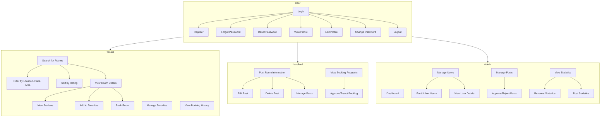

```mermaid
graph TD
  subgraph User
    direction TB
    A[Login] --> B[Register]
    A --> C[Forgot Password]
    A --> D[Reset Password]
    A --> E[View Profile]
    A --> F[Edit Profile]
    A --> G[Change Password]
    A --> H[Logout]
  end

  subgraph Tenant
    direction TB
    I[Search for Rooms] --> J[Filter by Location, Price, Area]
    I --> K[Sort by Rating]
    I --> L[View Room Details]
    L --> M[View Reviews]
    L --> N[Add to Favorites]
    L --> O[Book Room]
    P[Manage Favorites]
    Q[View Booking History]
  end

  subgraph Landlord
    direction TB
    R[Post Room Information] --> S[Edit Post]
    R --> T[Delete Post]
    R --> U[Manage Posts]
    V[View Booking Requests] --> W[Approve/Reject Booking]
  end

  subgraph Admin
    direction TB
    X[Dashboard]
    Y[Manage Users] --> Z[Ban/Unban Users]
    Y --> AA[View User Details]
    AB[Manage Posts] --> AC[Approve/Reject Posts]
    AD[View Statistics] --> AE[Revenue Statistics]
    AD --> AF[Post Statistics]
  end

  User --> Tenant
  User --> Landlord
  User --> Admin
```