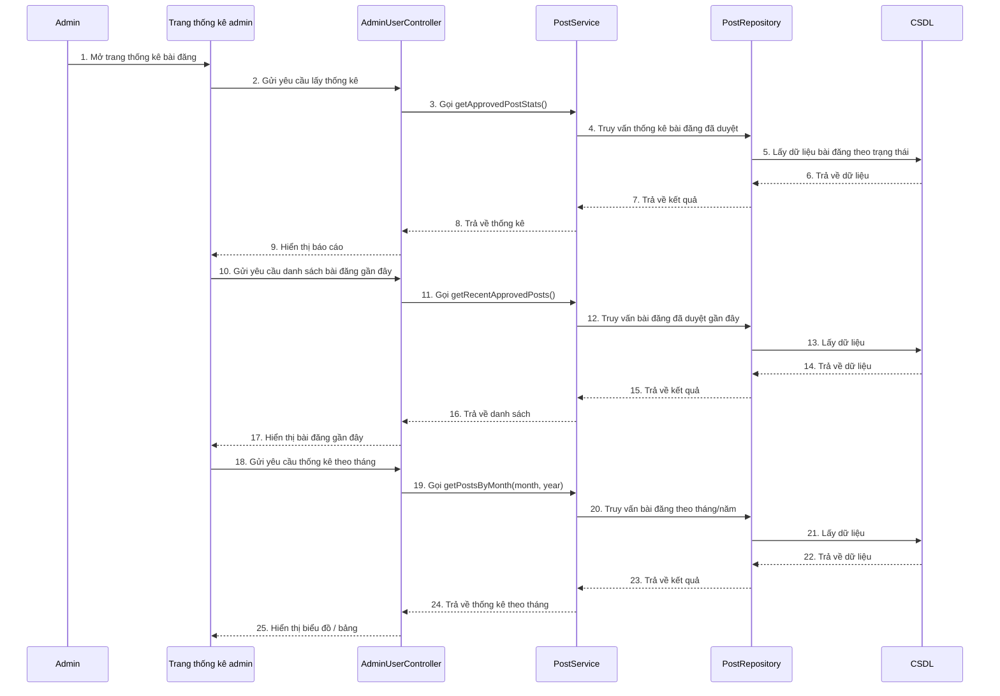

# Sequence xem thống kê bài đăng bên ADMIN

## Mô tả luồng

### 1. Xem thống kê tổng quan
1. Admin truy cập trang thống kê bài đăng.
2. Frontend gọi `GET /api/users/posts/stats`.
3. `AdminUserController` gọi `PostService.getApprovedPostStats()`.
4. `PostService` truy vấn dữ liệu từ `PostRepository`.
5. Kết quả thống kê được trả về cho giao diện.

### 2. Xem bài đăng gần đây đã duyệt
1. Admin mở phần bài đăng gần đây.
2. Frontend gọi `GET /api/users/posts/recent-approved`.
3. `AdminUserController` gọi `PostService.getRecentApprovedPosts()`.
4. Dữ liệu được truy vấn và hiển thị.

### 3. Xem thống kê theo tháng
1. Admin chọn tháng/năm cần xem.
2. Frontend gọi `GET /api/users/posts/by-month?month=&year=`.
3. `AdminUserController` gọi `PostService.getPostsByMonth(month, year)`.
4. Dữ liệu được trả về và hiển thị trên biểu đồ hoặc bảng.

## Ghi chú

- Các endpoint chính:
  - `GET /api/users/posts/stats`
  - `GET /api/users/posts/recent-approved`
  - `GET /api/users/posts/by-month`
- `PostService` là nơi tổng hợp dữ liệu thống kê cho admin.
- Các thống kê này bám sát các API hiện có trong `AdminUserController`.
