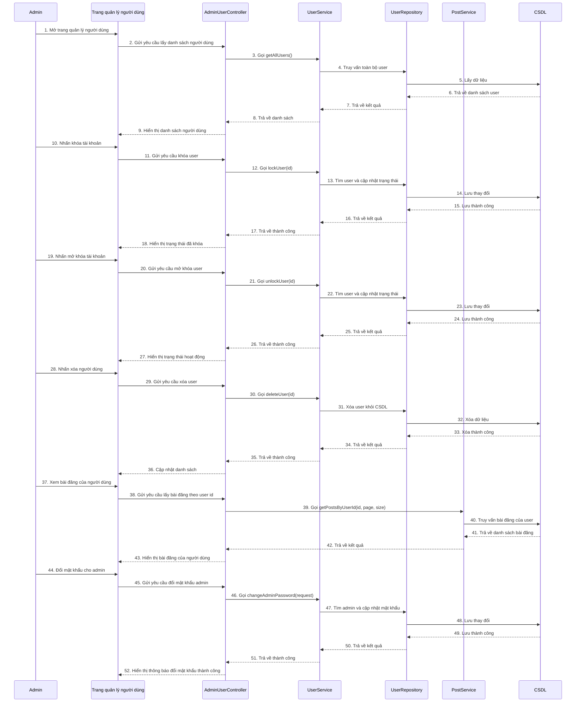

# Sequence quản lý người dùng của ADMIN

## Mô tả luồng

### 1. Xem danh sách người dùng
1. Admin mở trang quản lý người dùng.
2. Frontend gọi `GET /api/users`.
3. `AdminUserController` gọi `UserService.getAllUsers()`.
4. `UserService` truy vấn `UserRepository`.
5. Danh sách người dùng được trả về và hiển thị.

### 2. Khóa / mở khóa người dùng
1. Admin chọn một người dùng và nhấn khóa hoặc mở khóa.
2. Frontend gọi `PUT /api/users/lock/{id}` hoặc `PUT /api/users/unlock/{id}`.
3. `UserService` cập nhật trạng thái người dùng trong CSDL.
4. Giao diện cập nhật trạng thái mới.

### 3. Xóa người dùng
1. Admin chọn người dùng và xác nhận xóa.
2. Frontend gọi `DELETE /api/users/{id}`.
3. `UserService` xóa người dùng khỏi CSDL.
4. Danh sách người dùng được cập nhật.

### 4. Xem bài đăng của người dùng
1. Admin chọn một người dùng.
2. Frontend gọi `GET /api/users/{id}/posts?page=&size=`.
3. `AdminUserController` gọi `PostService.getPostsByUserId()`.
4. Danh sách bài đăng của user được hiển thị.

### 5. Đổi mật khẩu admin
1. Admin truy cập khu vực đổi mật khẩu.
2. Frontend gọi `PUT /api/users/change-password`.
3. `UserService.changeAdminPassword()` cập nhật mật khẩu admin.
4. Hệ thống thông báo thành công.

## Ghi chú

- Các endpoint chính:
  - `GET /api/users`
  - `PUT /api/users/lock/{id}`
  - `PUT /api/users/unlock/{id}`
  - `DELETE /api/users/{id}`
  - `GET /api/users/{id}/posts`
  - `PUT /api/users/change-password`
- `AdminUserController` đảm nhiệm toàn bộ API quản trị tài khoản.
- `UserService` xử lý logic khóa/mở khóa/xóa người dùng và đổi mật khẩu admin.
