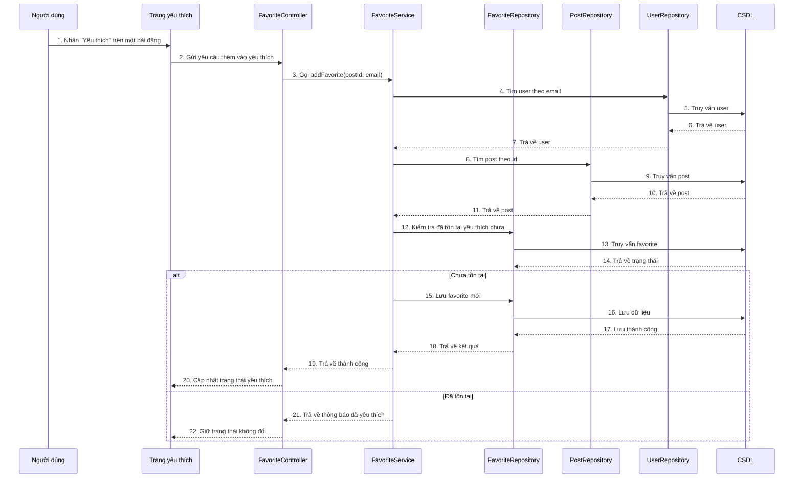

# Sequence thêm bài đăng yêu thích

## Mô tả luồng

1. Người dùng nhấn nút yêu thích trên một bài đăng.
2. Frontend gửi yêu cầu đến `FavoriteController`.
3. `FavoriteController` gọi `FavoriteService.addFavorite(postId, email)`.
4. `FavoriteService` lấy thông tin người dùng từ `UserRepository`.
5. `FavoriteService` lấy thông tin bài đăng từ `PostRepository`.
6. `FavoriteRepository` kiểm tra xem bài đăng này đã được yêu thích bởi người dùng hay chưa.
7. Nếu chưa tồn tại, hệ thống tạo bản ghi yêu thích mới trong CSDL.
8. Frontend cập nhật lại trạng thái yêu thích trên UI.

## Ghi chú

- Endpoint chính của chức năng: `POST /api/favorites/like/{postId}`.
- `FavoriteService` là nơi xử lý nghiệp vụ kiểm tra và lưu yêu thích.
- `FavoriteRepository` đảm nhiệm thao tác dữ liệu với bảng yêu thích.
