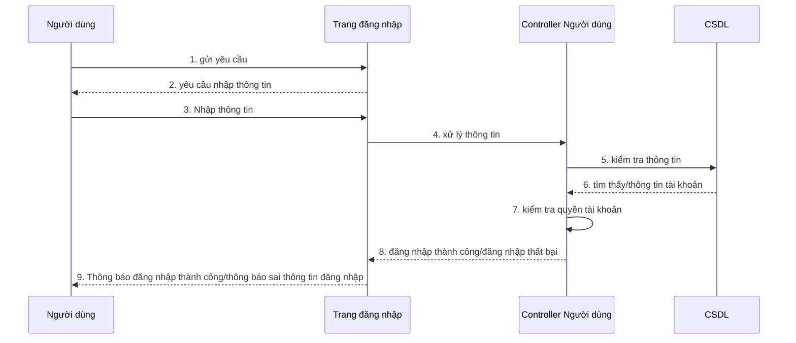

# Sequence đăng nhập hệ thống NhaTrangStay

**Mô tả:**
- Người dùng truy cập trang đăng nhập, nhập thông tin tài khoản.
- Controller kiểm tra thông tin với CSDL, xác thực quyền.
- Kết quả trả về: thành công hoặc thất bại, thông báo cho người dùng.

> Sơ đồ này phản ánh đúng luồng xử lý thực tế trong mã nguồn Spring Boot của đồ án NhaTrangStay.
