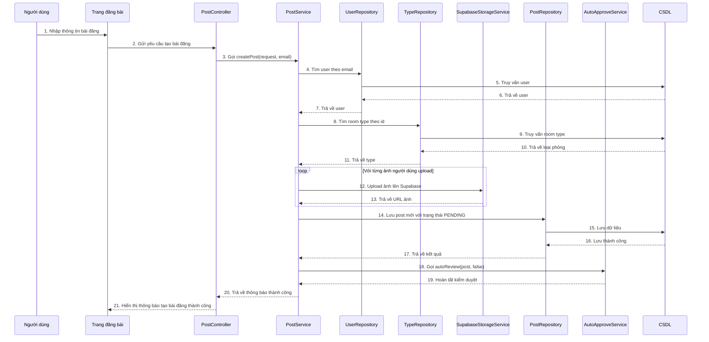

# Sequence đăng bài

## Mô tả luồng

1. Người dùng đăng nhập và truy cập màn hình tạo bài đăng.
2. Người dùng nhập thông tin phòng, địa chỉ, mô tả, giá, diện tích, số phòng và upload ảnh.
3. `CreatePostPage` gửi dữ liệu tới `PostController`.
4. `PostController` gọi `PostService.createPost(request, email)`.
5. `PostService` lấy thông tin người dùng và loại phòng từ CSDL.
6. Mỗi ảnh được upload lên Supabase thông qua `SupabaseStorageService`.
7. Bài đăng được lưu với trạng thái `PENDING`.
8. Hệ thống tự động gọi `AutoApproveService` để kiểm duyệt bài đăng.
9. Kết quả được trả về cho giao diện để người dùng biết bài đăng đã được tạo.

## Ghi chú

- Bài đăng được lưu ở trạng thái `PENDING` trước khi được tự động duyệt.
- `AutoApproveService` sử dụng OpenRouter/Gemini để đánh giá nội dung và ảnh.
- Upload ảnh dùng `SupabaseStorageService` để lưu tài nguyên trực tuyến.
- Endpoint chính: `POST /api/posts/create`.
