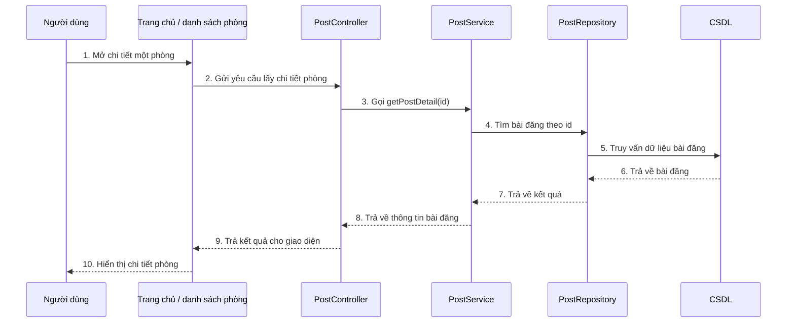

# Sequence xem chi tiết phòng

## Mô tả luồng

1. Người dùng chọn một phòng từ danh sách hoặc trang chủ.
2. Frontend gọi API `GET /api/posts/{id}` thông qua `PostController`.
3. `PostController` chuyển yêu cầu đến `PostService`.
4. `PostService` dùng `PostRepository` truy vấn bài đăng theo `id`.
5. Dữ liệu được lấy từ CSDL và trả ngược về chuỗi xử lý.
6. Kết quả được trả về cho frontend và hiển thị chi tiết phòng cho người dùng.

## Ghi chú

- Luồng này phù hợp với cách hiện tại dự án NhaTrangStay hiển thị chi tiết phòng.
- Endpoint chính: `GET /api/posts/{id}`.
- Dữ liệu phòng được truy vấn trực tiếp từ bảng bài đăng trong CSDL.
