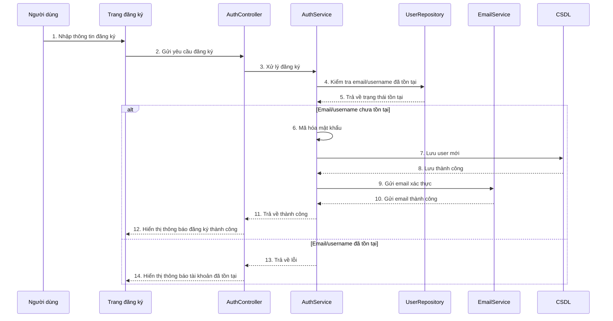

# Sequence đăng ký hệ thống NhaTrangStay

## Mô tả luồng

1. Người dùng truy cập trang đăng ký và nhập thông tin.
2. Frontend gửi dữ liệu đến `AuthController`.
3. `AuthController` chuyển yêu cầu sang `AuthService`.
4. `AuthService` kiểm tra dữ liệu với `UserRepository`.
5. Nếu email hoặc username đã tồn tại, hệ thống trả về lỗi.
6. Nếu hợp lệ, mật khẩu được mã hóa.
7. Thông tin người dùng được lưu vào CSDL.
8. Hệ thống gửi email xác thực cho người dùng.
9. Frontend hiển thị thông báo đăng ký thành công hoặc thất bại.

## Ghi chú

- Luồng này phản ánh chức năng đăng ký hiện có trong dự án NhaTrangStay.
- Ứng dụng đang sử dụng Spring Boot, Spring Security và gửi email xác thực cho người dùng mới.
