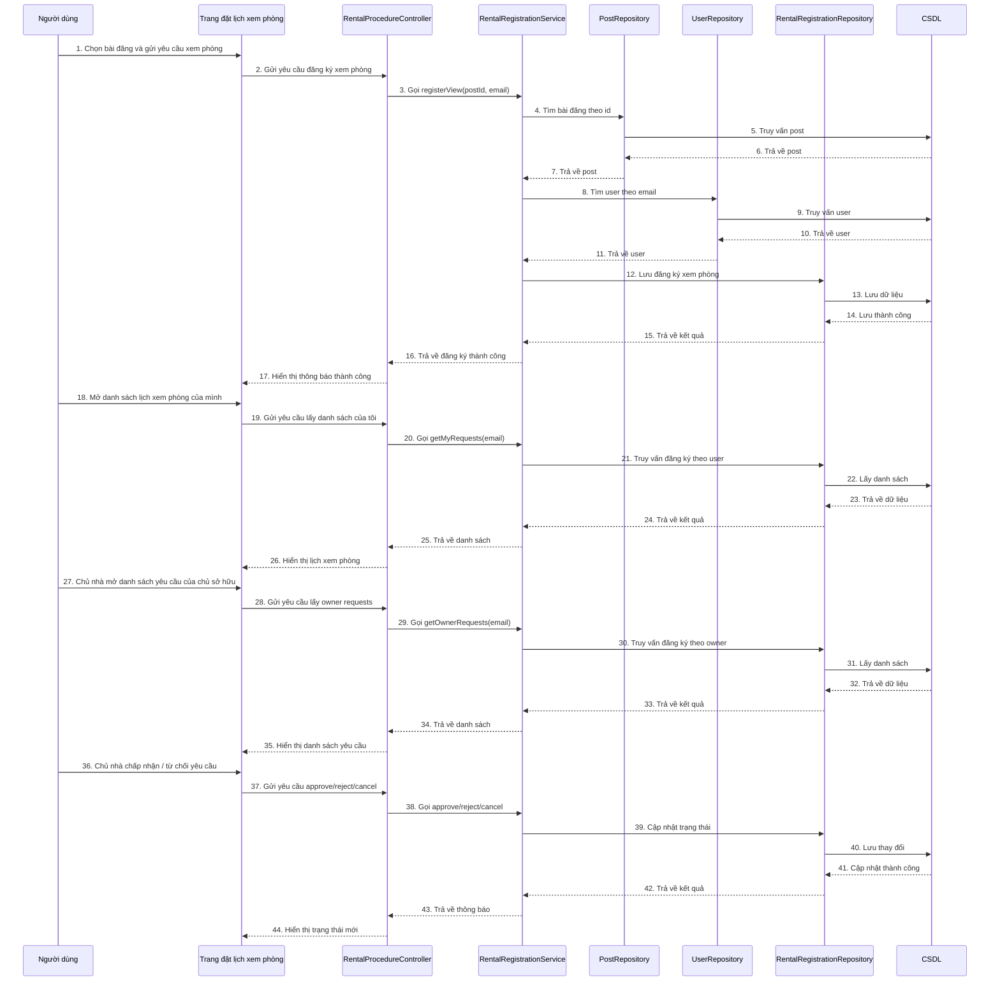

# Sequence đặt lịch xem phòng

## Mô tả luồng

### 1. Đăng ký xem phòng
1. Người dùng chọn một bài đăng và nhấn yêu cầu xem phòng.
2. Frontend gọi `POST /api/rental-procedures/register-view/{postId}`.
3. `RentalProcedureController` chuyển yêu cầu sang `RentalRegistrationService`.
4. `RentalRegistrationService` kiểm tra bài đăng và người dùng tồn tại.
5. Hệ thống lưu đăng ký xem phòng vào CSDL.
6. Giao diện hiển thị thông báo đăng ký thành công.

### 2. Xem danh sách lịch của tôi
1. Người dùng mở trang cá nhân hoặc lịch đã đặt.
2. Frontend gọi `GET /api/rental-procedures/my-requests`.
3. `RentalProcedureController` lấy dữ liệu từ `RentalRegistrationService`.
4. Dữ liệu được trả về và hiển thị cho người dùng.

### 3. Xem yêu cầu của chủ nhà
1. Chủ nhà truy cập danh sách yêu cầu xem phòng.
2. Frontend gọi `GET /api/rental-procedures/owner-requests`.
3. `RentalRegistrationService` truy vấn các yêu cầu thuộc bài đăng của chủ nhà.
4. Danh sách hiển thị lên giao diện.

### 4. Duyệt / từ chối / hủy
1. Chủ nhà hoặc người thuê thao tác trên một yêu cầu.
2. Frontend gửi yêu cầu đến các endpoint approve/reject/cancel.
3. `RentalRegistrationService` cập nhật trạng thái trong CSDL.
4. Giao diện phản ánh trạng thái mới.

## Ghi chú

- Endpoint chính:
  - `POST /api/rental-procedures/register-view/{postId}`
  - `GET /api/rental-procedures/my-requests`
  - `GET /api/rental-procedures/owner-requests`
  - `PUT /api/rental-procedures/approve/{id}`
  - `PUT /api/rental-procedures/reject/{id}`
  - `PUT /api/rental-procedures/cancel/{id}`
- `RentalRegistrationService` xử lý nghiệp vụ đặt lịch và cập nhật trạng thái.
- `RentalRegistrationRepository` chịu trách nhiệm truy vấn và lưu dữ liệu đăng ký.
