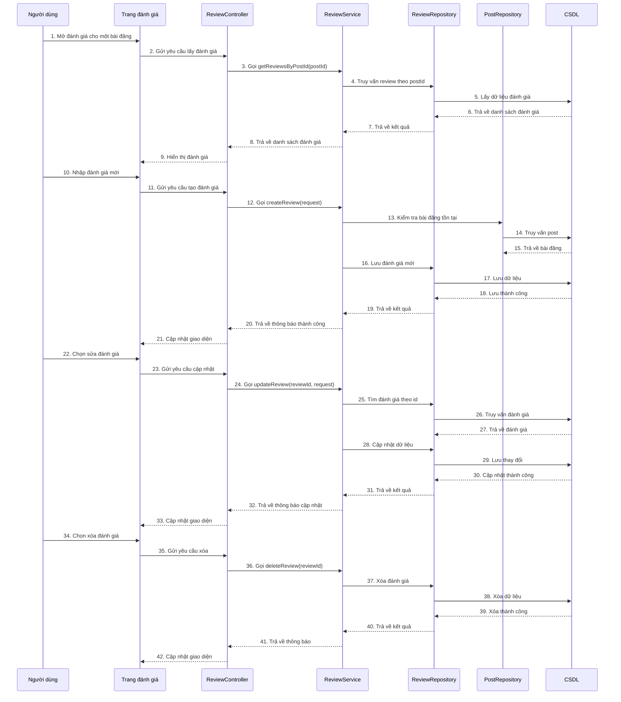

# Sequence đánh giá bài đăng

## Mô tả luồng

### 1. Xem đánh giá bài đăng
1. Người dùng mở trang chi tiết phòng.
2. Frontend gọi `GET /api/reviews/post/{postId}`.
3. `ReviewController` gọi `ReviewService` để lấy danh sách đánh giá.
4. `ReviewRepository` truy vấn dữ liệu từ CSDL.
5. Danh sách đánh giá được trả về và hiển thị.

### 2. Tạo đánh giá
1. Người dùng nhập nội dung đánh giá và gửi.
2. Frontend gọi API tạo đánh giá.
3. `ReviewService` kiểm tra bài đăng tồn tại.
4. Thông tin đánh giá được lưu vào CSDL.
5. Giao diện cập nhật lại danh sách đánh giá.

### 3. Sửa đánh giá
1. Người dùng chọn một đánh giá và chỉnh sửa.
2. Frontend gửi yêu cầu cập nhật.
3. `ReviewService` tìm đánh giá theo `reviewId`.
4. Dữ liệu được cập nhật trong CSDL.
5. Giao diện phản ánh thay đổi mới.

### 4. Xóa đánh giá
1. Người dùng chọn xóa đánh giá.
2. Frontend gửi yêu cầu xóa.
3. `ReviewService` gọi `ReviewRepository` để xóa.
4. Dữ liệu bị xóa khỏi CSDL.
5. Giao diện cập nhật lại.

## Ghi chú

- Các endpoint chính:
  - `GET /api/reviews/post/{postId}`
  - `POST /api/reviews/create`
  - `PUT /api/reviews/edit/{reviewId}`
  - `DELETE /api/reviews/delete/{reviewId}`
- `ReviewService` là trung tâm xử lý nghiệp vụ đánh giá.
- `ReviewRepository` chịu trách nhiệm thao tác dữ liệu với CSDL.
