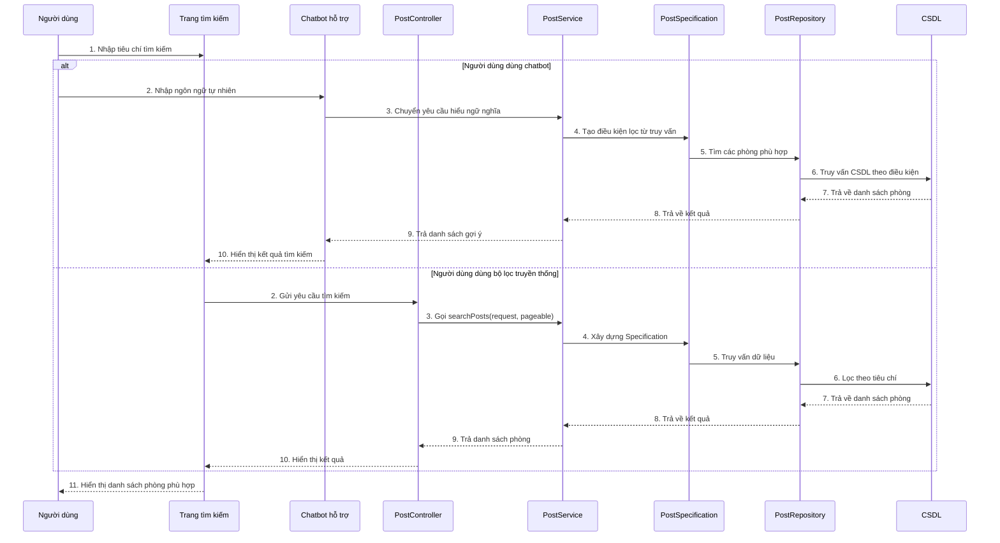

# Sequence tìm kiếm phòng (kèm chatbot hỗ trợ)

## Mô tả luồng

### 1. Tìm kiếm thông thường
1. Người dùng nhập tiêu chí tìm kiếm trên giao diện.
2. `SearchPage` gửi yêu cầu đến `PostController`.
3. `PostController` gọi `PostService.searchPosts()`.
4. `PostService` tạo `Specification` thông qua `PostSpecification`.
5. `PostRepository` truy vấn CSDL theo điều kiện lọc.
6. Kết quả trả về và được hiển thị lên giao diện.

### 2. Tìm kiếm bằng chatbot hỗ trợ
1. Người dùng nhập câu hỏi tự nhiên vào chatbot.
2. Chatbot chuyển yêu cầu đến `PostService` để hiểu ý định tìm kiếm.
3. `PostSpecification` tạo điều kiện lọc từ truy vấn.
4. Hệ thống truy vấn CSDL và trả về phòng phù hợp.
5. Chatbot hiển thị kết quả hoặc gợi ý cho người dùng.

## Ghi chú

- Endpoint chính của tìm kiếm: `GET /api/posts/search`.
- `PostSpecification` là nơi xử lý bộ lọc nâng cao.
- Bot hỗ trợ có thể giúp người dùng tìm kiếm bằng câu tự nhiên thay vì chỉ nhập tiêu chí cố định.
